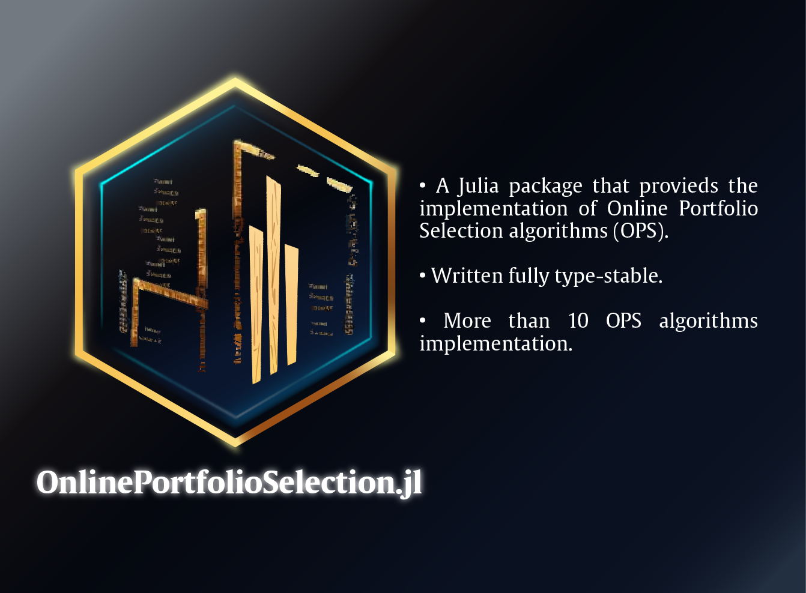

<div align="center">



<table>
    <!-- Docs -->
    <tr>
        <td>Documentation (Latest)</td>
        <td>
            <a href="https://shayandavoodii.github.io/OnlinePortfolioSelection.jl/dev/"></a>
        </td>
    </tr>
    <!-- Tests -->
    <tr>
        <td>Continuous Integration</td>
        <td>
            <a href="https://github.com/shayandavoodii/OnlinePortfolioSelection.jl/actions/workflows/ci.yml"></a>
        </td>
    </tr>
    <!-- Coverage -->
    <tr>
        <td>Coverage</td>
        <td>
            <a href="https://codecov.io/gh/shayandavoodii/OnlinePortfolioSelection.jl"></a>
        </td>
    </tr>
    <!-- DOI -->
    <tr>
        <td>DOI</td>
        <td>
            <a href="https://doi.org/10.5281/zenodo.10251038"></a>
        </td>
    </tr>
</table>

</div>

---
<div id="top"></div>

<!-- TABLE OF CONTENTS -->
<ol>
  <li><a href="#about">About</a></li>
  <li><a href="#disclaimer">Disclaimer</a></li>
  <li><a href="#quick-start">Quick Start</a></li>
  <ul>
    <li><a href="#installation">Installation</a></li>
    <li><a href="#example">Example</a></li>
    <li><a href="#Run-from-Python">Run from Python</a></li>
  </ul>
  <li><a href="#to-do-list">TODO LIST</a></li>
  <li><a href="#contribution">Contribution</a></li>
  <li><a href="#motivation">Motivation</a></li>
  <li><a href="#citation">Citation</a></li>
  <li><a href="#license">License</a></li>
  <li><a href="#contact">Contact</a></li>
</ol>

<!-- About -->
## About

<div align="justify">
This package presents a selection of proposed Online Portfolio Selection (OPS) algorithms found in the literature. The algorithms are implemented in Julia, ensuring complete type stability and suitability for research applications. It's an actively evolving package, with ongoing development work to introduce additional published methods. The aim is to introduce novel methods following the implementation of fundamental benchmark approaches. Presently, the package includes the following algorithms:
</div>
<div align="center">

| Row № | Algorithm                                                                                                                                                          | Strategy                  | Row № | Algorithm                                                                                                                                                          | Strategy           |
|:-----:|:-----------------------------------------------------------------------------------------------------------------------------------------------------------------: |:--------------------------|:-----:|:------------------------------------------------------------------------------------------------------------------------------------------------------------------ |:------------------ |
| 1     | [CORN](https://shayandavoodii.github.io/OnlinePortfolioSelection.jl/dev/PM/#Correlation-driven-Nonparametric-Learning-(CORN))                                      | Pattern-Matching          | 14    | [CW-OGD](https://shayandavoodii.github.io/OnlinePortfolioSelection.jl/dev/ML/#Combination-Weights-based-on-Online-Gradient-Descent-(CW-OGD))                       | Meta-Learning      |
| 2     | [DRICORN-K](https://shayandavoodii.github.io/OnlinePortfolioSelection.jl/dev/PM/#Dynamic-RIsk-CORrelation-driven-Non-parametric-(DRICORN))                         | Pattern-Matching          | 15    | [ClusLog](https://shayandavoodii.github.io/OnlinePortfolioSelection.jl/dev/PM/#ClusLog)                                                                            | Pattern-Matching   |
| 3     | [CRP](https://shayandavoodii.github.io/OnlinePortfolioSelection.jl/dev/benchmark/#Constant-Rebalanced-Portfolio-(CRP))                                             | Benchmark (Market)        | 16    | [PAMR](https://shayandavoodii.github.io/OnlinePortfolioSelection.jl/dev/FL/#Passive-Aggressive-Mean-Reversion-(PAMR))                                              | Follow the Loser   |
| 4     | [UP](https://shayandavoodii.github.io/OnlinePortfolioSelection.jl/dev/benchmark/#Universal-Portfolio-(UP))                                                         | Benchmark (Market)        | 17    | [PPT](https://shayandavoodii.github.io/OnlinePortfolioSelection.jl/dev/FW/#Price-Peak-Tracking-(PPT))                                                              | Follow the Winner  |
| 5     | [EG](https://shayandavoodii.github.io/OnlinePortfolioSelection.jl/dev/FW/#Exponential-Gradient-(EG))                                                               | Follow the Winner         | 18    | [CWMR](https://shayandavoodii.github.io/OnlinePortfolioSelection.jl/dev/FL/#Confidence-Weighted-Mean-Reversion-(CWMR))                                             | Follow the Loser   |
| 6     | [BS](https://shayandavoodii.github.io/OnlinePortfolioSelection.jl/dev/benchmark/#Best-Stock-(BS))                                                                  | Benchmark (Market)        | 19    | [CAEG](https://shayandavoodii.github.io/OnlinePortfolioSelection.jl/dev/ML/#Continuous-Aggregating-Exponential-Gradient-(CAEG))                                    | Meta-Learning      |
| 7     | [RPRT](https://shayandavoodii.github.io/OnlinePortfolioSelection.jl/dev/FL/#Reweighted-Price-Relative-Tracking-System-for-Automatic-Portfolio-Optimization-(RPRT)) | Follow the Loser          | 20    | [OLDEM](https://shayandavoodii.github.io/OnlinePortfolioSelection.jl/dev/PM/#Online-Low-Dimension-Ensemble-Method-(OLDEM))                                         | Pattern-Matching   |
| 8     | [Anticor](https://shayandavoodii.github.io/OnlinePortfolioSelection.jl/dev/FL/#Anti-Correlation-(Anticor))                                                         | Follow the Loser          | 21    | [AICTR](https://shayandavoodii.github.io/OnlinePortfolioSelection.jl/dev/FW/#Adaptive-Input-and-Composite-Trend-Representation-(AICTR))                            | Follow the Winner  |
| 9     | [1/N](https://shayandavoodii.github.io/OnlinePortfolioSelection.jl/dev/benchmark/#Uniform-Portfolio-(1/N))                                                         | Benchmark (Market)        | 22    | [EGM](https://shayandavoodii.github.io/OnlinePortfolioSelection.jl/dev/FW/#Exponential-Gradient-with-Momentum-(EGM))                                               | Follow the Winner  |
|10     | [OLMAR](https://shayandavoodii.github.io/OnlinePortfolioSelection.jl/dev/FL/#Online-Moving-Average-Reversion-(OLMAR))                                              | Follow the Loser          | 23    | [TPPT](https://shayandavoodii.github.io/OnlinePortfolioSelection.jl/dev/Combined/#Trend-Promote-Price-Tracking-(TPPT))                                             | Combination of Strategies |
|11     | [Bᴷ](https://shayandavoodii.github.io/OnlinePortfolioSelection.jl/dev/PM/#Bᴷ)                                                                                      | Pattern-Matching          | 24    | [GWR](https://shayandavoodii.github.io/OnlinePortfolioSelection.jl/dev/FL/#Gaussian-Weighting-Reversion-(GWR))                                                     | Follow the Loser   |
|12     | [LOAD](https://shayandavoodii.github.io/OnlinePortfolioSelection.jl/dev/Combined/#LOcal-ADaptive-learning-system-(LOAD))                                           | Combination of Strategies | 25    | [ONS](https://shayandavoodii.github.io/OnlinePortfolioSelection.jl/dev/benchmark/#Online-Newton-Step-(ONS))                                                        | Benchmark (Market) |
|13     | [MRvol](https://shayandavoodii.github.io/OnlinePortfolioSelection.jl/dev/Combined/#MRvol)                                                                          | Combination of Strategies |
</div>

<p align="right">🆙<a href="#top">Table of cotents</a></p>

<!-- Disclaimer -->
## Disclaimer

<div align="justify">

This package is designed exclusively for **research purposes** and **explicitly not for investment use**. The author(s) hold no responsibility for any financial losses or damages incurred from using this package for investment or financial purposes.

</div>
<p align="right">🆙<a href="#top">Table of cotents</a></p>

---
<!-- Quick Start -->
## Quick Start

<!-- Installation -->
### Installation

<div align="justify">

The most recent stable version of the package can be installed by entering the following command in the Julia REPL after typing <code>]</code>:
</div>

```julia
pkg> add OnlinePortfolioSelection
```

or

```julia
julia> using Pkg; Pkg.add("OnlinePortfolioSelection")
```
<div align="justify">
Additionally, the development version of the package can be installed by executing the following command in the Julia REPL after entering <code>]</code>:
</div>


```julia
pkg> dev OnlinePortfolioSelection
```

<p align="right">🆙<a href="#top">Table of cotents</a></p>

<!-- Example -->
### Example

<div align="justify">
The full list of available strategies can be obtained by executing the following command after importing the package:
</div>


```julia
julia> using OnlinePortfolioSelection

julia> opsmethods()
```

<div align="justify">
In summary, all the implemented algorithms' names appear with lowercase letters. All of the strategies return an object of type <a href="https://shayandavoodii.github.io/OnlinePortfolioSelection.jl/dev/types/#OnlinePortfolioSelection.OPSAlgorithm"><code>OPSAlgorithm</code></a>, which encompasses the following fields:
</div>


```julia
julia> fieldnames(OPSAlgorithm)
(:n_assets, :b, :alg)
```

<div align="justify">

- `n_assets`: conveying the number of assets.
- `b`: containing the corresponding weights of each asset in each investment period.
- `alg`: representing the name of the algorithm that resulted in the output.

To obtain more information about a specific strategy, you can type <code>?</code> in the REPL and then call the name of the strategy. For example, to access more details about the 'CORN-K' strategy, run the following command:
</div>

```julia
help?> cornk
```
<div align="justify">
Finally, to execute the 'CORN-K' strategy, use the following commands:
</div>


```julia
juila> using OnlinePortfolioSelection

# Generate a random price matrix. The rows are the assets, and the columns represent the time.
julia> adj_close_random = rand(10, 100);

# Set the parameters of the strategy
julia> hor = 10; # The investment horizon
julia> nexp = 5; # The number of experts
julia> ml_tw = 3; # The maximum length of the time windows to be examined
julia> ml_cor = 5; # The maximum number of correlation coefficients to be examined

# Run the algorithm
julia> m_cornk = cornk(adj_close_random, hor, nexp, ml_tw, ml_cor)
******************************************************************************
This program contains Ipopt, a library for large-scale nonlinear optimization.
 Ipopt is released as open source code under the Eclipse Public License (EPL).
         For more information visit https://github.com/coin-or/Ipopt
******************************************************************************

# Get weights
julia> m_cornk.b
10×10 Matrix{Float64}:
 0.088856    0.147974     …  0.00084875  0.223069
 0.0         0.0             0.00347507  0.0
 0.101514    0.000792416     0.00100889  0.0553558
 0.00913491  0.0805729       0.00100889  0.10233
 0.683795    0.0             0.31303     0.0
 0.00913491  0.0          …  0.0         0.0407096
 0.0350864   0.0208009       0.251554    0.239765
 0.0         0.219552        0.395477    0.0
 0.0232303   0.349871        0.0131345   0.163805
 0.0492489   0.180437        0.0204634   0.174965
```
<div align="justify">
For further details regarding the implemented strategies and the API, please refer to the <a href="https://shayandavoodii.github.io/OnlinePortfolioSelection.jl/dev/">documentation</a>.
</div>
<p align="right">🆙<a href="#top">Table of cotents</a></p>

<!-- Run from Python -->
### Run from Python

<div align="justify">
The package can be used from Python by using the <a href="https://pyjulia.readthedocs.io/en/latest/installation.html">PyJulia</a> package as follows:
</div>


```python
$ pip install julia
```

And then run the following commands in Python:

```python
>>> import julia
>>> julia.install()
...
Precompiling PyCall...
Precompiling PyCall... DONE
PyCall is installed and built successfully.
>>> from julia import Pkg
>>> Pkg.add("OnlinePortfolioSelection")
>>> from julia import OnlinePortfolioSelection as OPS

# Generate a random relatvive price matrix. The rows are the assets, and the columns represent the time.
>>> import numpy as np
>>> rel_pr = np.random.rand(3, 100)
>>> rel_vol = np.random.rand(3, 100)
>>> horizon = 10; Wₘᵢₙ = 4; Wₘₐₓ = 10; λ = 0.05; η = 0.01;
>>> model = OPS.mrvol(rel_pr, rel_vol, horizon, Wₘᵢₙ, Wₘₐₓ, λ, η)
>>> model.b
array([[0.33333333, 0.36104291, 0.3814967 , 0.26303273, 0.16525094,
        0.23471654, 0.28741473, 0.34746891, 0.41769629, 0.34582386],
       [0.33333333, 0.35745995, 0.24895616, 0.30306051, 0.36527706,
        0.2817696 , 0.36959982, 0.43371551, 0.48357232, 0.51374896],
       [0.33333333, 0.28149714, 0.36954713, 0.43390676, 0.469472  ,
        0.48351386, 0.34298546, 0.21881558, 0.09873139, 0.14042718]])
>>> type(model.b)
<class 'numpy.ndarray'>
>>> model.b.sum(axis=0)
array([1., 1., 1., 1., 1., 1., 1., 1., 1., 1.])
>>> model.alg
'MRvol'
>>> model.n_assets
3
```
<div align="justify">
As you can see, the package can be used from Python easily. For more information, check the <a href="https://shayandavoodii.github.io/OnlinePortfolioSelection.jl/dev/python">documentation</a>.
</div>
<p align="right">🆙<a href="#top">Table of cotents</a></p>

---
<!-- TODO LIST -->
## To-do list

- [ ] Implement BCRP
- [x] ~~Implement CORN~~
- [x] ~~Implement DRICORN~~
- [x] ~~Implement BS~~
- [x] ~~Implement Anticor~~
- [x] ~~Implement $B^k$~~
- [ ] Implement $B^{NN}$
- etc.

<p align="right">🆙<a href="#top">Table of cotents</a></p>

<!-- Contribution -->
## Contribution

<div align="justify">
Contributions are warmly welcome. Please feel free to open an issue and discuss the changes you want to make. Afterward, fork the repo and make the changes. Then, open a pull request, and I will review and hopefully merge it.
</div>

<p align="right">🆙<a href="#top">Table of cotents</a></p>

<!-- Motivation -->
## Motivation

<div align="justify">
I aimed to implement benchmark methods for Online Portfolio Selection (OPS) as part of my M.Sc. thesis to conduct comprehensive benchmarking experiments. The goal was to compare the performance of these benchmark methods with my proposed method from my thesis. I decided to transform this into an open-source package so that other researchers could leverage these established methods for their own research, sparing them the effort of reimplementing existing strategies. My intention is to continue developing and expanding this package to include more algorithms as I find it an exciting area of study. Ultimately, I hope this contribution proves beneficial to the research community.
</div>

<p align="right">🆙<a href="#top">Table of cotents</a></p>

<!-- Citation -->
## Citation

<div align="justify">
If you use the package in your research, please cite the package using the following BibTeX entry:
</div>

```bibtex
@software{shayan_davoodi_2023_10251038,
  author       = {Shayan Davoodi},
  title        = {shayandavoodii/OnlinePortfolioSelection.jl: v2.6.1},
  month        = dec,
  year         = 2023,
  publisher    = {Zenodo},
  version      = {v2.6.1},
  doi          = {10.5281/zenodo.10251038},
  url          = {https://doi.org/10.5281/zenodo.10251038}
}
```

<div align="justify">
Other citation styles can be found <a href="https://doi.org/10.5281/zenodo.7905042">here</a> at the bottom of the page (Export section).
</div>

<p align="right">🆙<a href="#top">Table of cotents</a></p>

<!-- License -->
## License

<div align="justify">
This project is licensed under the MIT License - see the <a href="https://github.com/shayandavoodii/OnlinePortfolioSelection.jl/blob/main/LICENSE">LICENSE</a> file for details.
</div>
<p align="right">🆙<a href="#top">Table of cotents</a></p>

<!-- Contact -->
## Contact

<div align="justify">
If you have any inquiries or suggestions, please don't hesitate to contact me via email at <a href="mailto:sh0davoodi@gmail.com">sh0davoodi@gmail.com</a>. Alternatively, feel free to open an issue in the repository.
</div>
<p align="right">🆙<a href="#top">Table of cotents</a></p>
