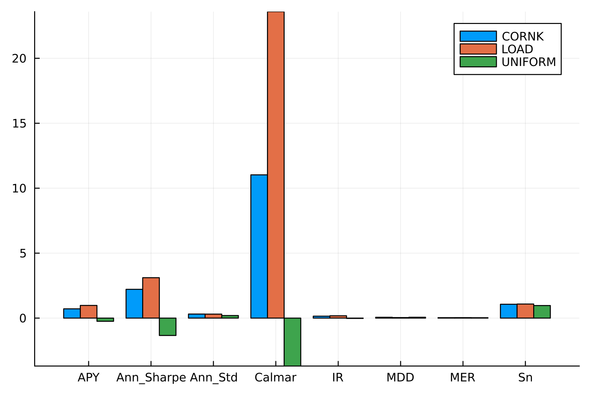

# Performance evaluation {#Performance-evaluation}

This package provides a variety of metrics for evaluating algorithm performance. These metrics are widely recognized in the literature and serve as benchmarks for comparing the performances of different algorithms. Currently, the supported metrics include:

| Row № | Metric                                                                                      |       Abbreviation       |         Direction         |
|:-----:|:------------------------------------------------------------------------------------------- |:------------------------:|:-------------------------:|
|   1   | [Cumulative Wealth](/performance_eval#Cumulative-Wealth-(CW,-Also-known-as-S_n))            | CW (Also known as $S_n$) | The **higher** the better |
|   2   | [Mean Excess Return](/performance_eval#Mean-Excess-Return-(MER))                            |           MER            | The **higher** the better |
|   3   | [Information Ratio](/performance_eval#Information-Ratio-(IR))                               |            IR            | The **higher** the better |
|   4   | [Annualized Percentage Yield](/performance_eval#Annualized-Percentage-Yield-(APY))          |           APY            | The **higher** the better |
|   5   | [Annualized Standard Deviation](/performance_eval#Annualized-Standard-Deviation-(\sigma_p)) |        $\sigma_p$        |   The lower the better    |
|   6   | [Annualized Sharpe Ratio](/performance_eval#Annualized-Sharpe-Ratio-(SR))                   |            SR            | The **higher** the better |
|   7   | [Maximum Drawdown](/performance_eval#Maximum-Drawdown-(MDD))                                |           MDD            |   The lower the better    |
|   8   | [Calmar Ratio](/performance_eval#Calmar-Ratio-(CR))                                         |            CR            | The **higher** the better |
|   9   | [Average Turnover](/performance_eval#Average-Turnover-(AT))                                 |            AT            |   The lower the better    |


## Metrics {#Metrics}

### Cumulative Wealth (CW, Also known as $S_n$) {#Cumulative-Wealth-CW,-Also-known-as-S_n}

This metric computes the portfolio&#39;s cumulative wealth of the algorithm throughout an investment period. The cumulative wealth is defined as:

$$\begin{aligned}
{S_n} = {S_0}\prod\limits_{t = 1}^T {\left\langle {{b_t},{x_t}} \right\rangle }
\end{aligned}$$

where $S_0$ represents the initial capital, $b_t$ stands for the portfolio vector at time $t$, and $x_t$ denotes the relative price vector at time $t$. This metric can be evaluated using the [`sn`](/funcs#OnlinePortfolioSelection.sn-Union{Tuple{T},%20Tuple{AbstractMatrix{T},%20AbstractMatrix{T}}}%20where%20T<:AbstractFloat) function.

### Mean Excess Return (MER) {#Mean-Excess-Return-MER}

MER is utilized to gauge the average excess returns of an OPS method that surpasses the benchmark market strategy. MER is defined as:

$$MER = {1 \over n}\sum\nolimits_{t = 1}^n {{R_t} - } {1 \over n}\sum\nolimits_{t = 1}^n {R_t^*}$$

where $R$ and ${R_t^*}$ represent the daily returns of a portfolio and the market strategy at the $t$th trading day, respectively. For a given OPS method, accounting for transaction costs, ${{R_t}}$ is calculated by ${R_t} = \left( {\mathbf{x}_t\mathbf{b}_t} \right) \times \left( {1 - {\nu  \over 2} \times \sum\nolimits_{i = 1}^d {\left| {{b_{t,i}} - {{\tilde b}_{t,i}}} \right|} } \right) - 1$. The market strategy initially allocates capital equally among all assets and remains unchanged. ${R_t^*}$ is defined as: $R_t^* = \mathbf{x}_t \cdot \mathbf{b}^* - 1$ and ${\mathbf{b}^*} = {\left( {{1 \over d},{1 \over d}, \ldots ,{1 \over d}} \right)^ \top }$, where $d$ is the number of assets, and $n$ is the number of trading days. This metric can be calculated using the [`mer`](/funcs#OnlinePortfolioSelection.mer-Union{Tuple{T},%20Tuple{AbstractMatrix{T},%20AbstractMatrix{T}},%20Tuple{AbstractMatrix{T},%20AbstractMatrix{T},%20T}}%20where%20T<:AbstractFloat) function. (see [[25](/refs#XI2023109872)] for more details.)

### Information Ratio (IR) {#Information-Ratio-IR}

The information ratio is a risk-adjusted excess return metric compared with the market benchmark. It is defined as:

$$IR = \frac{{{{\bar R}_s} - {{\bar R}_m}}}{{\sigma \left( {{R_s} - {R_m}} \right)}}$$

where $R_s$ represents the portfolio&#39;s daily return, $R_m$ represents the market&#39;s daily return, $\bar R_s$ represents the portfolio&#39;s average daily return, $\bar R_m$ represents the market&#39;s average daily return, and $\sigma$ represents the standard deviation of the portfolio&#39;s daily excess return over the market. Note that in this package, the logarithmic return is used. See [`ir`](/funcs#OnlinePortfolioSelection.ir-Union{Tuple{S},%20Tuple{AbstractMatrix{S},%20AbstractMatrix{S},%20AbstractVector{S}}}%20where%20S<:AbstractFloat).

### Annualized Percentage Yield (APY) {#Annualized-Percentage-Yield-APY}

This metric computes the annualized return of the algorithm throughout the investment period. The annualized return is defined as:

$$\begin{aligned}
{APY} = \left( {{S_n}} \right)^{\frac{1}{y}} - 1
\end{aligned}$$

where $y$ represents the number of years in the investment period. This metric can be evaluated using the [`apy`](/funcs#OnlinePortfolioSelection.apy-Union{Tuple{S},%20Tuple{AbstractFloat,%20S}}%20where%20S<:Int64) function.

### Annualized Standard Deviation ($\sigma_p$) {#Annualized-Standard-Deviation-\sigma_p}

Another measurement employed to assess risk is the annual standard deviation of portfolio returns. The daily standard deviation is computed to derive the annual standard deviation, after which it is multiplied by $\sqrt{252}$ (assuming 252 days in a year). Users can adjust the number of days in a year by specifying the `dpy` keyword argument. This metric can be computed using the [`ann_std`](/funcs#OnlinePortfolioSelection.ann_std-Tuple{AbstractVector{<:AbstractFloat}}) function.

### Annualized Sharpe Ratio (SR) {#Annualized-Sharpe-Ratio-SR}

The Sharpe ratio serves as a measure of risk-adjusted return. It is defined as:

$$\begin{aligned}
SR = {{APY - {R_f}} \over {{\sigma _p}}}
\end{aligned}$$

Here, $R_f$ denotes the risk-free rate, typically equivalent to the treasury bill rate at the investment period. This metric can be computed using the [`ann_sharpe`](/funcs#OnlinePortfolioSelection.ann_sharpe-Union{Tuple{T},%20Tuple{T,%20T,%20T}}%20where%20T<:AbstractFloat) function.

### Maximum Drawdown (MDD) {#Maximum-Drawdown-MDD}

The maximum drawdown is the largest drop percentage of [CW](/performance_eval#Cumulative-Wealth-(CW,-Also-known-as-S_n)) from its running maximum over all periods, which looks for the most considerable movement from a peak point to a trough point. Following the definition of [Li _et al._ [19]](/refs#LI2022115889), the maximum drawdown is defined as:

$$MDD = \mathop {\max }\limits_{t \in \left[ {1,T} \right]} \frac{{{M_t} - {S_t}}}{{{M_t}}},\quad {M_t} = \mathop {\max }\limits_{k \in \left[ {1,t} \right]} {S_k}$$

where $M_t$ represents the running maximum of CW, and $S_t$ represents the CW at time $t$. This metric can be calculated using the [`mdd`](/funcs#OnlinePortfolioSelection.mdd-Union{Tuple{AbstractVector{T}},%20Tuple{T}}%20where%20T<:AbstractFloat) function.

### Calmar Ratio (CR) {#Calmar-Ratio-CR}

The Calmar ratio is a risk-adjusted return metric based on the maximum drawdown. It is defined as:

$$\begin{aligned}
CR = {{APY} \over {MDD}}
\end{aligned}$$

This metric can be computed using the [`calmar`](/funcs#OnlinePortfolioSelection.calmar-Union{Tuple{T},%20Tuple{T,%20T}}%20where%20T<:AbstractFloat) function.

### Average Turnover (AT) {#Average-Turnover-AT}

This measure computes how frequently the weight of each asset is changing during the investment period. The lower the AT, the better is performance of the algorithm. The AT can be calculated by:

$$AT = \frac{{{{\sum\nolimits_{t = 2}^T {\left\| {{{\mathbf{b}}_t} - {{\hat {\mathbf{b}}}_{t - 1}}} \right\|} }_1}}}{{2\left( {T - 1} \right)}}$$

where $T$ represents the number of investing days, ${{{\hat {\mathbf{b}}}_{t - 1}}}$ denotes the adjusted portfolio at the end of the $(t − 1)$-th day, which can be calculated using ${\hat {\mathbf{b}}_{t - 1}} = \frac{{{\mathbf{x}_{t - 1}} \odot {\mathbf{b}_{t - 1}}}}{{{\mathbf{x}_{t - 1}}^ \top {\mathbf{b}_{t - 1}}}}$ in which ${{{\mathbf{x}}_{t - 1}}}$ is the price relative vector at time period $t-1$, and ${\left\|  \cdot  \right\|_1}$ is the L1-norm operator. This metric can be calculated using the [`at`](/funcs#OnlinePortfolioSelection.at-Tuple{AbstractMatrix,%20AbstractMatrix}) function.

::: tip Note

It&#39;s noteworthy that these metrics can be computed collectively rather than individually. This can be achieved using the [`opsmetrics`](/funcs#OnlinePortfolioSelection.opsmetrics-Union{Tuple{S},%20Tuple{T},%20Tuple{AbstractMatrix{T},%20AbstractMatrix{T},%20AbstractVector{T}}}%20where%20{T<:AbstractFloat,%20S<:Int64}) function. This function yields an object of type [`OPSMetrics`](/types#OnlinePortfolioSelection.OPSMetrics) containing all the aforementioned metrics.

:::

## Examples {#Examples}

Below is a simple example that illustrates how to utilize the metrics. Initially, I utilize the [`opsmetrics`](/funcs#OnlinePortfolioSelection.opsmetrics-Union{Tuple{S},%20Tuple{T},%20Tuple{AbstractMatrix{T},%20AbstractMatrix{T},%20AbstractVector{T}}}%20where%20{T<:AbstractFloat,%20S<:Int64}) function to compute all the metrics collectively. Subsequently, I present the procedure to compute each metric individually.

### [`opsmetrics`](/funcs#OnlinePortfolioSelection.opsmetrics-Union{Tuple{S},%20Tuple{T},%20Tuple{AbstractMatrix{T},%20AbstractMatrix{T},%20AbstractVector{T}}}%20where%20{T<:AbstractFloat,%20S<:Int64}) function {#opsmetrics@ref-function}

The [`opsmetrics`](/funcs#OnlinePortfolioSelection.opsmetrics-Union{Tuple{S},%20Tuple{T},%20Tuple{AbstractMatrix{T},%20AbstractMatrix{T},%20AbstractVector{T}}}%20where%20{T<:AbstractFloat,%20S<:Int64}) function facilitates the computation of all metrics simultaneously. It requires the following positional arguments:
- `weights`: A matrix sized $m \times t$, representing the portfolio weights on each trading day utilizing the chosen OPS algorithm.
  
- `rel_pr`: A matrix sized $m \times t$, which includes the relative prices of assets on each trading day. Typically, these prices are computed as $\frac{p_{t,i}}{p_{t-1,i}}$ in most studies, where $p_{t,i}$ denotes the price of asset $i$ at time $t$. Alternatively, in some studies, relative prices are calculated as $\frac{c_{t,i}}{o_{t,i}}$, where $c_{t,i}$ and $o_{t,i}$ are the closing and opening prices of asset $i$ at time $t$. The user can decide which relative prices to employ and input the corresponding matrix into the function.
  
- `rel_pr_market`: A vector sized $t$, which includes the relative prices of the market benchmark on each trading day. The relative prices of the market benchmark are computed similarly to the relative prices of assets. Note that the function takes the last `t` values of the vector if `rel_pr_market` containts more than `t` values.
  

Additionally, the function accepts the following keyword arguments:
- `init_inv=1.`: The initial investment, which is set to `1.0` by default.
  
- `RF=0.02`: The risk-free rate, which is set to `0.02` by default.
  
- `dpy=252`: The number of days in a year, which is set to `252` days by default.
  
- `v=0.`: The transaction cost rate, which is set to `0.0` by default.
  

The function returns an object of type [`OPSMetrics`](/types#OnlinePortfolioSelection.OPSMetrics) containing all the metrics as fields. Now, let&#39;s choose few algorithms and assess their performance using the aforementioned function.

```julia
julia> using OnlinePortfolioSelection, YFinance, StatsPlots

# Fetch data
julia> tickers = ["AAPL", "MSFT", "AMZN", "META", "GOOG"];

julia> startdt, enddt = "2023-04-01", "2023-08-27";

julia> querry = [get_prices(ticker, startdt=startdt, enddt=enddt)["adjclose"] for ticker in tickers];

julia> prices = stack(querry) |> permutedims;

julia> market = get_prices("^GSPC", startdt=startdt, enddt=enddt)["adjclose"];

julia> rel_pr = prices[:, 2:end]./prices[:, 1:end-1];

julia> rel_pr_market = market[2:end]./market[1:end-1];

julia> nassets, ndays = size(rel_pr);

# Run algorithms for 30 days
julia> horizon = 30;

# Run models on the given data
julia> loadm = load(prices, 0.5, 8, horizon, 0.1);
julia> uniformm = uniform(nassets, horizon);
julia> cornkm = cornk(prices, horizon, 5, 5, 10, progress=true);
┣████████████████████████████████████████┫ 100.0% |30/30 

julia> names = ["LOAD", "UNIFORM", "CORNK"];

julia> metrics = (:Sn, :MER, :IR, :APY, :Ann_Std, :Ann_Sharpe, :MDD, :Calmar);

julia> all_metrics_vals = opsmetrics.([loadm.b, uniformm.b, cornkm.b], Ref(rel_pr), Ref(rel_pr_market));

# Draw a bar plot to depict the values of each metric for each algorithm
julia> groupedbar(
         vcat([repeat([String(metric)], length(names)) for metric in metrics]...),
         [getfield(result, metric) |> last for metric in metrics for result in all_metrics_vals],
         group=repeat(names, length(metrics)),
         dpi=300
       )
```





The plot illustrates the value of each metric for each algorithm. 

### Individual functions {#Individual-functions}

The metrics can be calculated individually as well. For instance, in the next code block, I compute each metric individually for the &#39;CORNK&#39; algorithm.

```julia
# Compute the cumulative wealth
julia> sn_ = sn(cornkm.b, rel_pr)
31-element Vector{Float64}:
 1.0
 1.0056658141861143
 1.0456910599891474
 ⋮
 1.0812597940398256
 1.0561895221684217
 1.0661252685319844

# Compute the mean excess return
julia> mer(cornkm.b, rel_pr)
0.0331885901993342

# Compute the information ratio
julia> ir(cornkm.b, rel_pr, rel_pr_market)
0.14797935671154802

# Compute the annualized return
julia> apy_ = apy(last(sn_), size(cornkm.b, 2))
0.7123367957886144

# Compute the annualized standard deviation
julia> ann_std_ = ann_std(sn_, dpy=252)
0.312367085936459

# Compute the annualized sharpe ratio
julia> rf = 0.02
julia> ann_sharpe(apy_, rf, ann_std_)
2.216420445556956

# Compute the maximum drawdown
julia> mdd_ = mdd(sn_)
0.06460283126873347

# Compute the calmar ratio
julia> calmar(apy_, mdd_)
11.026402121997583

# Compute the average turnover
julia> at(rel_pr, cornkm.b)
0.5710393403115563 # Meaning that the weight of each asset is changing 57% of the time

julia> last(all_metrics_vals)

            Cumulative Wealth: 1.066125303122296
        Mean Excessive Return: 0.03318859854896919
            Information Ratio: 0.1479792121956763
  Annualized Percentage Yield: 0.7123372624638589
Annualized Standard Deviation: 0.31236709233949556
      Annualized Sharpe Ratio: 2.216421894119991
             Maximum Drawdown: 0.06460283279345515
                 Calmar Ratio: 11.026409085516526
             Average Turnover: 0.5710393403115563
```


As shown, the results are consistent with the results obtained using the [`opsmetrics`](/funcs#OnlinePortfolioSelection.opsmetrics-Union{Tuple{S},%20Tuple{T},%20Tuple{AbstractMatrix{T},%20AbstractMatrix{T},%20AbstractVector{T}}}%20where%20{T<:AbstractFloat,%20S<:Int64}) function. Individual functions can be found in [Functions](/funcs#Functions) (see [`sn`](/funcs#OnlinePortfolioSelection.sn-Union{Tuple{T},%20Tuple{AbstractMatrix{T},%20AbstractMatrix{T}}}%20where%20T<:AbstractFloat), [`mer`](/funcs#OnlinePortfolioSelection.mer-Union{Tuple{T},%20Tuple{AbstractMatrix{T},%20AbstractMatrix{T}},%20Tuple{AbstractMatrix{T},%20AbstractMatrix{T},%20T}}%20where%20T<:AbstractFloat), [`ir`](/funcs#OnlinePortfolioSelection.ir-Union{Tuple{S},%20Tuple{AbstractMatrix{S},%20AbstractMatrix{S},%20AbstractVector{S}}}%20where%20S<:AbstractFloat), [`apy`](/funcs#OnlinePortfolioSelection.apy-Union{Tuple{S},%20Tuple{AbstractFloat,%20S}}%20where%20S<:Int64), [`ann_std`](/funcs#OnlinePortfolioSelection.ann_std-Tuple{AbstractVector{<:AbstractFloat}}), [`ann_sharpe`](/funcs#OnlinePortfolioSelection.ann_sharpe-Union{Tuple{T},%20Tuple{T,%20T,%20T}}%20where%20T<:AbstractFloat), [`mdd`](/funcs#OnlinePortfolioSelection.mdd-Union{Tuple{AbstractVector{T}},%20Tuple{T}}%20where%20T<:AbstractFloat), [`calmar`](/funcs#OnlinePortfolioSelection.calmar-Union{Tuple{T},%20Tuple{T,%20T}}%20where%20T<:AbstractFloat), and [`at`](/funcs#OnlinePortfolioSelection.at-Tuple{AbstractMatrix,%20AbstractMatrix}) for more information).

### Tests {#Tests}

In order to investigate whether there are significant differences between some algorithms or not, a statistical analysis can be performed in which, a hypothesis test is considered for paired samples. In this hypothesis test, the difference between the paired samples is the target parameter in which, the paired samples are the [APY](/performance_eval#Annualized-Percentage-Yield-(APY)) of two algorithms applied on different datasets [[24](/refs#KHEDMATI2020113546)]. Suppose you want to compare the performance of [`EG`](/FW#Exponential-Gradient-(EG)), [`EGM`](/FW#Exponential-Gradient-with-Momentum-(EGM)), and [`ONS`](/benchmark#Online-Newton-Step-(ONS)) algorithms:

::: tip Note

You have to install and import the [`HypothesisTests.jl`](https://github.com/JuliaStats/HypothesisTests.jl) package to use this function. One can install the aformentioned package using the following command in Julia REPL:

```julia
pkg> add HypothesisTests
```


:::

```julia
julia> using OnlinePortfolioSelection, HypothesisTests

# Vector of apy values for 3 datasets. I.e. apy value for EG algorithm for Dataset1 is 0.864
julia> apy_EG = [0.864, 0.04, 0.98];

julia> apy_WAEG = [0.754, 0.923, 0.123];

julia> apy_MAEG = [0.512, 0.143, 0.0026];

julia> apy_load = [0.952, 0.256, 0.156];

julia> apys = [apy_EG, apy_WAEG, apy_MAEG, apy_load];

julia> ttest(apys)
4×4 Matrix{Float64}:
 0.0  0.960744  0.321744  0.649426
 0.0  0.0       0.201017  0.638612
 0.0  0.0       0.0       0.14941
 0.0  0.0       0.0       0.0
```


The lower the p-values, the better is the performance. The returned matrix by [`ttest`](/funcs#OnlinePortfolioSelection.ttest) function is a square matrix in which the rows and columns represent the algorithms and the values represent the p-values of t-student test between each pair of algorithms. According to the output above, the performance of the &quot;MAEG&quot; algorithm dominates the &quot;LOAD&quot; algorithm.

To evaluate if the return of the proposed strategy could be due to simple luck, a statistical test can be conducted to measure the probability of this occurrence [[34](/refs#10.1145/3200692)]. It is possible to use the aformentioned [`ttest`](/funcs#OnlinePortfolioSelection.ttest) function to validate the rubustness of a trading algorithm. The following snippet code provides an example in this regard:

::: tip Note

You have to install the [`GLM.jl`](https://github.com/JuliaStats/GLM.jl) package using the following command in Julia REPL:

```julia
pkg> add GLM
```


:::

```julia
julia> using OnlinePortfolioSelection, GLM, YFinance

julia> benchmark_prices = get_prices("^GSPC", startdt="2020-02-01", enddt="2020-02-29")["adjclose"]

julia> benchmark_return = benchmark_prices[2:end]./benchmark_prices[1:end-1]

julia> portfolio_return = rand(0.9:1e-5:1.1, length(benchmark_return))

julia> daily_riskfree_return = 1.000156

julia> ttest(benchmark_return, portfolio_return, daily_riskfree_return)
StatsModels.TableRegressionModel{LinearModel{GLM.LmResp{Vector{Float64}}, GLM.DensePredChol{Float64, LinearAlgebra.CholeskyPivoted{Float64, Matrix{Float64}, Vector{Int64}}}}, Matrix{Float64}}

y ~ 1 + x

Coefficients:
────────────────────────────────────────────────────────────────────────────
                  Coef.  Std. Error      t  Pr(>|t|)   Lower 95%   Upper 95%
────────────────────────────────────────────────────────────────────────────
(Intercept)  -0.0224706   0.0117695  -1.91    0.0743  -0.0474209  0.00247968
x            -0.0860158   0.724261   -0.12    0.9069  -1.62138    1.44935
────────────────────────────────────────────────────────────────────────────
```


By analysing the table above, we can conclude that the returns gained by the algorithm are likely to be obtained by chance.

## References {#References}
1. Y. Li, X. Zheng, C. Chen, J. Wang and S. Xu. _Exponential Gradient with Momentum for Online Portfolio Selection_. [Expert Systems with Applications **187**, 115889](https://doi.org/10.1016/j.eswa.2021.115889) (2022).
  
2. M. Khedmati and P. Azin. _An online portfolio selection algorithm using clustering approaches and considering transaction costs_. [Expert Systems with Applications **159**, 113546](https://doi.org/10.1016/j.eswa.2020.113546) (2020).
  
3. W. Xi, Z. Li, X. Song and H. Ning. _Online portfolio selection with predictive instantaneous risk assessment_. [Pattern Recognition **144**, 109872](https://doi.org/10.1016/j.patcog.2023.109872) (2023).
  
4. D. Huang, S. Yu, B. Li, S. C. Hoi and S. Zhou. _Combination Forecasting Reversion Strategy for Online Portfolio Selection_. [ACM Trans. Intell. Syst. Technol. **9**](https://doi.org/10.1145/3200692) (2018).
  
